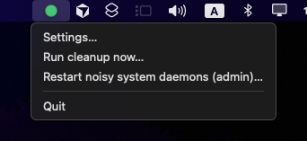
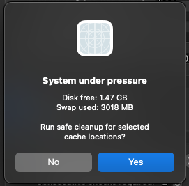
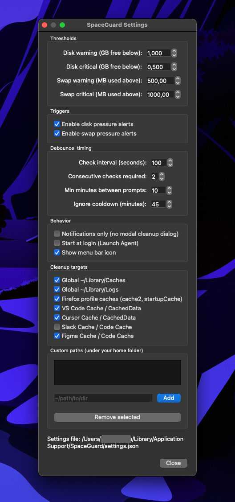

# SpaceGuard

macOS menu bar app: watches **free disk space** on the boot volume and **swap use**, shows a **color-coded tray icon**, and can ask before deleting **cache paths you choose** (with cooldowns so it does not nag).

[](https://github.com/landamartin/spaceguard_mac/actions/workflows/ci.yml)

<p align="center">
  
</p>

<p align="center">
  <em>Tray state follows thresholds; menu has Settings, cleanup, optional admin daemon restart, Quit.</em>
</p>

<p align="center">
  
</p>

<p align="center">
  <em>Prompt after pressure stays above your limits for a few polls (debounced).</em>
</p>

<p align="center">
  
</p>

<p align="center">
  <em>Thresholds, swap/disk toggles, debounce timings, cleanup targets, custom paths, start at login.</em>
</p>

## Behavior

- **Disk:** free space on `/` via `statvfs`.
- **Swap:** `sysctl vm.swapusage` (warning/critical levels are configurable).
- **Tray:** green / amber / red from your warning and critical limits.
- **Cleanup:** only removes directories you enable (presets and optional paths under your home). Optional “restart noisy daemons” is a **separate** menu action and asks for an admin password via macOS.

Details: [`docs/SPEC.md`](docs/SPEC.md). Contributor notes: [`AGENTS.md`](AGENTS.md).

## Install

**Releases:** [GitHub Releases](https://github.com/landamartin/spaceguard_mac/releases) — download the zip for a version tag, unzip, drag `SpaceGuard.app` to Applications.

First open: if macOS blocks it, **right-click → Open** once (ad-hoc signature until you ship with a Developer ID).

## Run from source

Python **3.11+**, [uv](https://github.com/astral-sh/uv):

```bash
uv sync --all-groups
uv run python -m spaceguard
```

PySide6 wheels are large; if install fails for disk space, free several GB or clear `~/.cache/uv` and retry. To reuse an interpreter that already has PySide6: `uv sync --all-groups --python /path/to/python3.11`.

## Build the `.app` locally

```bash
./scripts/build_mac_app.sh
```

Produces `dist/SpaceGuard.app` (Nuitka, minimal Qt plugins, menu-bar `LSUIElement` mode). For an **arm64** binary on Apple Silicon, use an arm64 Python with uv before sync/build (see script header).

## Tests

```bash
uv run pytest
uv run ruff check src tests
```

## Security

Report sensitive issues via [GitHub Security advisories](https://github.com/landamartin/spaceguard_mac/security/advisories/new) (see [`SECURITY.md`](SECURITY.md)). Repository settings (branch protection, Dependabot): [`docs/GITHUB_SETUP.md`](docs/GITHUB_SETUP.md).

## License

[MIT](LICENSE)
