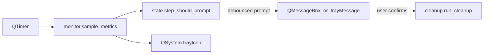

# Architecture

## Overview

SpaceGuard is a single-process **Qt Widgets** application: `QApplication` + `QSystemTrayIcon` + `QTimer`. There is **no** background worker thread for monitoring; polling and cleanup run on the main thread.

## Modules

| Module | Role |
|--------|------|
| `app.py` | `SpaceGuardController`: tray menu, timer tick, dialogs, wiring |
| `monitor.py` | `statvfs` disk free, `sysctl` swap parse |
| `state.py` | `TrayLevel`, `pressure_active`, debounce `step_should_prompt`, record helpers |
| `settings_store.py` | JSON defaults, load/save, schema version merge |
| `cleanup.py` | Expand preset paths, validate custom paths, `shutil.rmtree`, optional `osascript` admin helper |
| `launch_agent.py` | Write/load `com.spaceguard.mac` Launch Agent plist |

## Data flow

1. `QTimer` fires every `check_interval_sec`.
2. `sample_metrics()` builds `DiskSwapMetrics`.
3. Tray icon + tooltip update from `tray_level()` / formatted strings.
4. `pressure_active()` and `step_should_prompt()` decide whether to notify; on success, prompt is recorded then UI is shown.
5. Cleanup uses `collect_targets()` → `remove_path()` for each target.

## Persistence

Settings are merged with defaults on load (`_migrate`) so new keys do not break old files.
